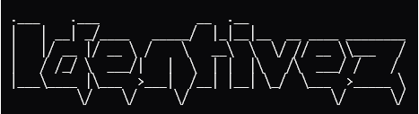

  

---

<pre>
$ whoami
> user: 1dent1vez
> role: Ing. TIC | Cybersecurity | Cloud Security Engineering
> bio:  "Construyendo herramientas de seguridad mientras aprendo la infraestructura donde residen."
</pre>

<pre>
$ cat ~/trayectoria.txt
[+] Estado actual: Ing. en TIC
[+] Enfoque:       Ciberseguridad (hands-on)
[+] Objetivo:      Cloud Security Engineer
</pre>

<pre>
$ ls -l --tree /stack/
.
├── 01_scripting_&_seguridad
│   └── [Python, Bash, Git]
├── 02_sistemas
│   └── [Linux, Docker]
├── 03_cloud_learning (learning)
│   └── [AWS, Terraform]
└── 04_hard_skills
    └── [Network recon, Password analysis, CTF]
</pre>

<pre>
$ finger projects

[Project: porT_scanneR]
    - Status: Stable
    - Desc:   Scanner de puertos y reconocimiento de red.
    - Stack:  Python
    - URL:    https://github.com/1dent1vez/porT_scanneR

[Project: PassworD-StrengtH-CheckeR]
    - Status: Stable
    - Desc:   Análisis de fortaleza + detección de brechas.
    - Stack:  Python
    - URL:    https://github.com/1dent1vez/PassworD-StrengtH-CheckeR-BreacH-DetectoR

[Project: Cloud-Security-Lab]
    - Status: En progreso
    - Desc:   Infraestructura cloud hardened desde cero.
    - Stack:  AWS, Terraform
</pre>

<pre>
$ cat /etc/principles.conf
- SECURITY_FIRST=true  # No es un parche, es la base del diseño.
- AUTOMATE_ALL=true    # Si es repetitivo, es código.
- DOCUMENT_STEP=true   # El proceso es el producto.
</pre>

<pre>
$ echo $CONTACT_INFO
- Email:    ghael.engineer@gmail.com
- Status:   Always learning.
</pre>

---

###  Actividad de Sistema

  
  

